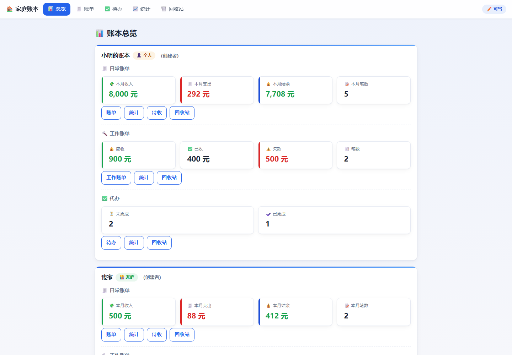
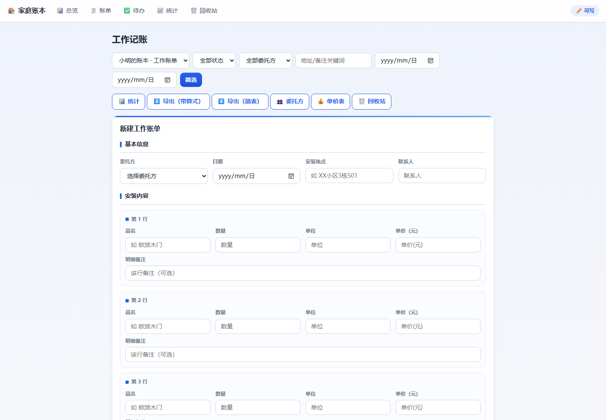
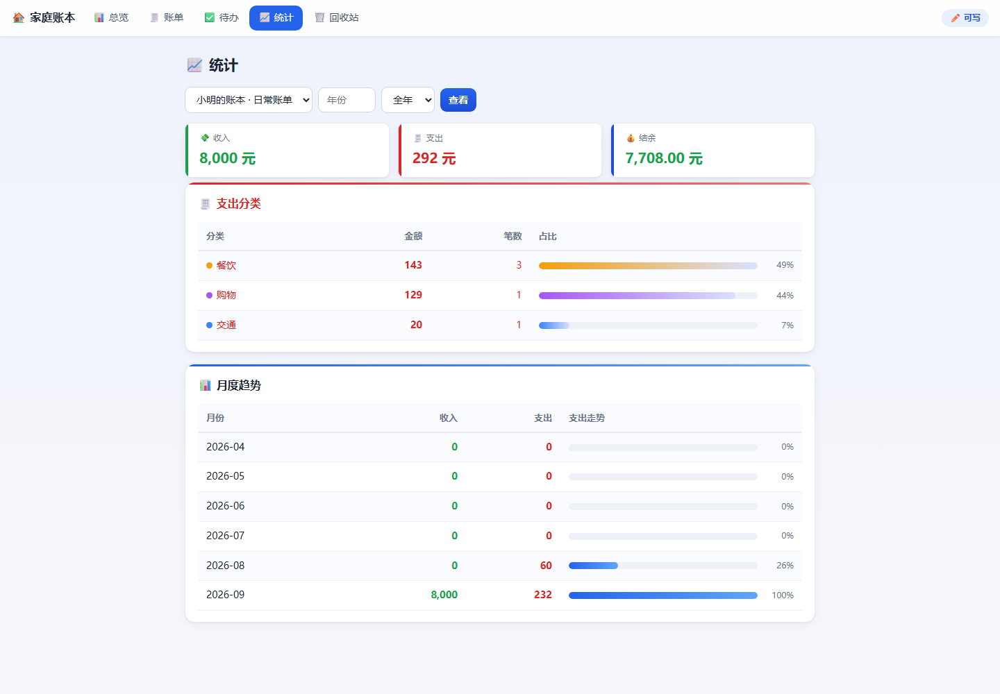
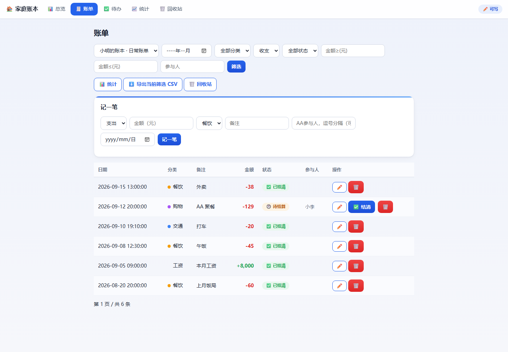
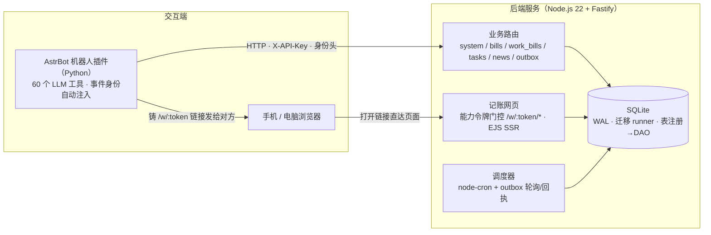

# 家庭信息助理系统（后端）

以 **QQ / 微信自然语言为统一入口**、面向个人/家庭的信息助理后端：身份登记、记账（日常 + 委托方工作账单）、待办、定时订阅与信息抓取、主动推送，并提供免登录、免 App 的记账网页入口。

## 界面截图

`assets/screenshots/*` 由演示数据（`scripts/seed-dev.mjs`）播种渲染：



<div align="center">
  
  
  
</div>

## 核心能力

| 域 | 能力 |
|----|------|
| **身份与多端** | `person` ↔ 多平台身份（QQ/微信 openid）合并、解绑，主身份自动移交；身份由请求头（`x-platform`/`x-openid`）注入，不进 LLM 上下文 |
| **账本** | 个人/家庭账本、成员角色、账单 CRUD、软删回收站 + 定时彻底清空、AA 分账、批量结算、收支统计、变更日志 |
| **记账 Web 页** | 能力令牌（write/read）门控 `/w/:token/*`，EJS 服务端渲染，打开链接即用，无需注册/登录；含 CSV 导出 |
| **工作账单** | 委托方 / 单价表维护，账单 + 多行明细自动计价，收款与结算，应收/已收/欠款派生状态 |
| **待办** | 任务增删改、分类、完成状态、按日期/关键词筛选（含网页端） |
| **订阅与抓取** | 定时任务/订阅管理 + outbox 生产/消费/回执；外部抓取适配器（RSS / Steam / 三角洲密码门 / 免费游戏） |
| **LLM 工具桥** | AstrBot 插件（Python）暴露 60 个 LLM 工具，自然语言完成「记一笔」「上个月花了多少」「给家人开个账本链接」等操作 |

**规模**：后端 TypeScript ~8,000 行 / 43 源文件 / 8 业务模块 / 5 次迁移定义 19 张表；AstrBot 插件 `main.py` 2,688 行。

## 架构概览



两个设计点：

1. **身份不进 LLM 上下文**：机器人收到消息时，插件从事件里解析 `platform + openid` 作为请求头带上，后端中间件据此解析 `person`。LLM 只负责「说什么」，不负责「我是谁」。
2. **「聊 → 网页」令牌模式**：需要给对方一个可操作界面时，机器人不引导装 App，而是铸一个能力令牌（write/read + 有效期），把 `/w/:token` 链接直接发出。网页按令牌只放行记账子域，不暴露整个 API；日志对 URL 中的 token 脱敏。

## 技术栈

| 层 | 选型 |
|----|------|
| 后端 | Node.js 22 · TypeScript · Fastify 5 |
| 存储 | SQLite（WAL）+ better-sqlite3 · 自研迁移 runner 与「表注册 → 通用 CRUD/DAO」层 |
| 页面 | EJS 服务端渲染（移动端表格 → 卡片自适应） |
| 调度 | node-cron + outbox（生产/消费/回执） |
| 桥接 | AstrBot 插件（Python）· LLM 工具调用（`filter.llm_tool`）· 60 工具 |
| 部署 | Docker Compose + ZeroTier 组网 |

## 目录结构

```
src/
├── index.ts            # 入口：配置 → 开库 → 迁移 → 恢复注册表 → 监听
├── app.ts              # Fastify 装配：统一错误/日志脱敏/模块路由注册
├── config.ts           # 环境配置（零硬编码）
├── db/                 # SQLite 连接(WAL/外键) · 迁移 runner · 表注册→DAO
├── lib/                # 身份注入中间件 · 公共工具
├── scheduler/          # node-cron + outbox 生产/消费
└── modules/
    ├── system/         # 身份/账本/健康检查/内部接口
    ├── bills/          # 记账（软删回收站/AA/统计/变更日志）
    ├── work_bills/     # 委托方/单价/工作账单/结算
    ├── tasks/          # 待办
    ├── news/ · outbox/ # 订阅/抓取 · outbox
    ├── bills_web/      # 能力令牌 + /w/:token/* 页面 + CSV
    └── internal/       # 内部表注册（管理员密钥）
plugins/
└── astrbot_star_homeassistant/   # AstrBot 机器人插件
docs/                   # 工具清单 / 适配器实现 / 代码走查记录
```

## 快速开始

```bash
npm install
cp .env.example .env          # 设置 X_API_KEY / ADMIN_KEY
npm run migrate               # 建表 / 迁移
npm run dev                   # http://127.0.0.1:3000 ，健康检查 GET /healthz
```

**看网页演示（演示数据 + 自动铸 24h 令牌）：**

```bash
npm run build                 # 编译 dist
node scripts/seed-dev.mjs     # 播种演示库，打印 /w/:token URL
npm run dev                   # 起服务后浏览器打开打印的 URL
```

## 里程碑

- **M0** 项目骨架 + DB 层（迁移/表注册/DAO）+ `/healthz`
- **M1** 身份与账本（persons/identities/accounts + 身份注入）
- **M2** 记账核心（CRUD/软删回收站/AA/stats/batch/changes）
- **M3** 调度 + outbox（提醒 / 账本日报 / 晨报 / 主动推送回执）
- **M4** 任务/订阅/新闻/外部抓取适配器（rss/steam/delta/free_game）
- **M5** 记账 Web 服务（能力令牌 + `/w/:token/*` + CSV 导出）
- **M6** 云端部署（Docker Compose + ZeroTier）
- **M7** AstrBot 插件（QQ/微信自然语言入口，60 工具）
